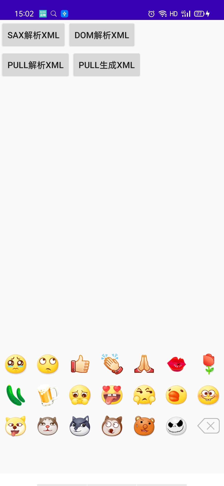
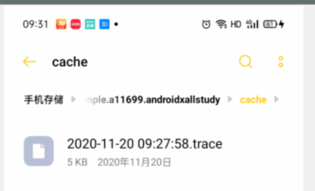
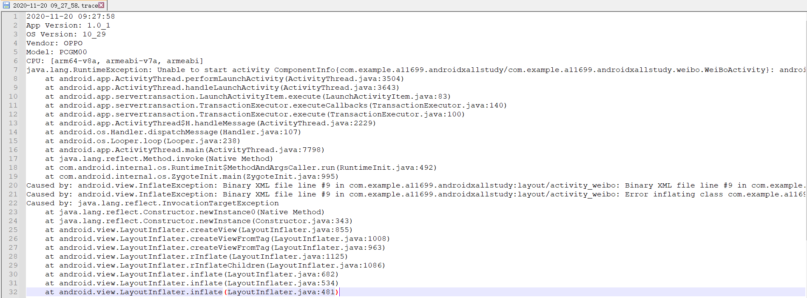

# AndroidXAllStudy

## 版本1
新增库：lib_customview 实现了类似微信的软件盘展示和消失效果，让交互更加顺畅

> 新增自定义View： SoftViewGroup.kt

使用规则:

* 父类里面必须有两个子类。
* 在每次需要更新状态的时候需要手动调用SoftViewGroup.kt里面的方法：

```kotlin
 soft_viewgroup.mEditText = editText
 soft_viewgroup.setValeToShowMore(state) //state: 0：默认第一次进入 1：展示更多页面 2：不展示更多页面
```

**具体案例见：库（comp_im）里的ImActivity.kt页面。**

效果如下:


## 版本2

仿照躺平实现Activity的切换转场动画

> 见底部导航栏Demo

实现过程：

&nbsp;&nbsp;&nbsp;&nbsp;&nbsp;&nbsp;&nbsp;&nbsp;使用了自定义Visibility实现Activity的转场动画。为什么要继承Visibility呢而不是继承Transition呢。

因为Visibility帮我们实现Activity可见状态和不可见状态的情况事件处理，我们只需要重写方法

onApper 和 onDIsapper方法就可以了。这两个方法可以实现去创建我们的自定义动画。详见类：Fade2.java类。

**注意的知识点**

> 想使用转场动画那么在开启一个Activity的时候需要使用方法：
>
> ```kotlin
> val intent = Intent(this, CopyTangApp::class.java)
> val pairs: Array<androidx.core.util.Pair<View, String>> = TransitionHelper.createSafeTransitionParticipants(this, true)
> var bundle = ActivityOptionsCompat.makeSceneTransitionAnimation(this@BottomTabActivity, *pairs).toBundle()
> startActivity(intent, bundle)
> ```
>还有 如果我们的转场动画如果想顺序执行的话需要在style里面添加：
>```xml
>  <item name="android:windowAllowEnterTransitionOverlap">true</item>
>  <item name="android:windowAllowReturnTransitionOverlap">true</item>
>```
>相反不想顺序执行的话那就将上面两个属性设置为false
>给Activity设置透明度度的话我们需要给指定的Acvitiy设置them。这里我给CopyTangApp设置了fade的主题
>```xml
>    <style name="fade" parent="AppTheme">
>        <item name="android:backgroundDimAmount">0.0</item><!-- 灰度 -->
>        <item name="android:windowBackground">@android:color/transparent</item>
>        <item name="android:windowFrame">@null</item>
>        <item name="android:windowNoTitle">true</item>
>        <item name="android:windowIsTranslucent">true</item>
>        <item name="android:windowContentOverlay">@null</item>
>        <item name="android:windowAnimationStyle">@null</item>
>        <item name="android:windowFullscreen">false</item>
>        <item name="android:backgroundDimEnabled">false</item>
>        <item name="android:colorBackgroundCacheHint">@null</item>
>        <item name="android:windowActionBar">false</item>
>        <item name="android:windowCloseOnTouchOutside">true</item>
>    </style>
>```
**具体案例见：app里的BottomTabActivity.kt页面。**
效果如下：


## 版本3
实现卡牌发放和反转的效果。
>新增自定义View： FlopView 和 FlopViewGroup
>新增库 module_flop
>实现思路 先用recycleview定位牌展示的位置
>然后给FlopView添加动画效果，让他移动到指定位置。
通过实现这个功能让我学习到：
1. Camera和Matrix的使用 用来实现view的3d效果 比如3d旋转。
2. 将本地的Drawable文件转换成bitmap
3. 关于Bitmap的知识。

效果如下:


## 版本4
学习了关于xml的读取写入学习
>新增类XmlStudyActivity.kt
[简书地址](https://www.jianshu.com/p/3f1d8394a2e1)
效果如下:



---

## 实现自定义的悬浮窗效果
>使用方法 使用的类 只需要继承FloatActivity类即可。
>详细实现代码见FloatActivity

如图：


**实现原理：**
我们知道一个Activity的层级分布是PhnowWindow -> Decorview在Decorview的FragmentLayout里面将我们悬浮窗view添加进去。

## 增加对奔溃日志手机
>增加类 CrashHandler
>使用方法在Application里面进行注册CrashHandler.getInstance().init(this)

收集信息如图：





## 自定义NestedScrollView实现监听滑动 指定对view实现缩放操作
>增加类TopViewScaleScrollView.kt
>使用：对想被执行缩放动画的view添加标签 android:tag="topview" 即可。
效果如下：


##写一个task用来启动一个Activity
>运行下面的任务 我们的Activity就会被开启
``grovvy
/**
 * 写个任务开启activity
 */
task run(type: Exec, dependsOn: 'installDebug') {
    description 'Installs the APK and runs the main activity: "gradlew :samples:???:run"'
    commandLine "${android.sdkDirectory}/platform-tools/adb", 'shell', 'am', 'start', '-n', 'com.example.a11699.androidxallstudy/.LoginActivity'
}
```
